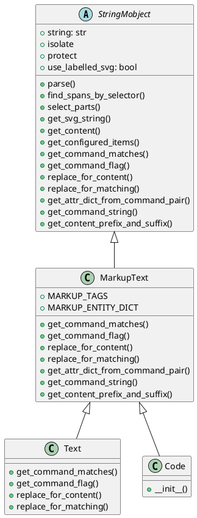
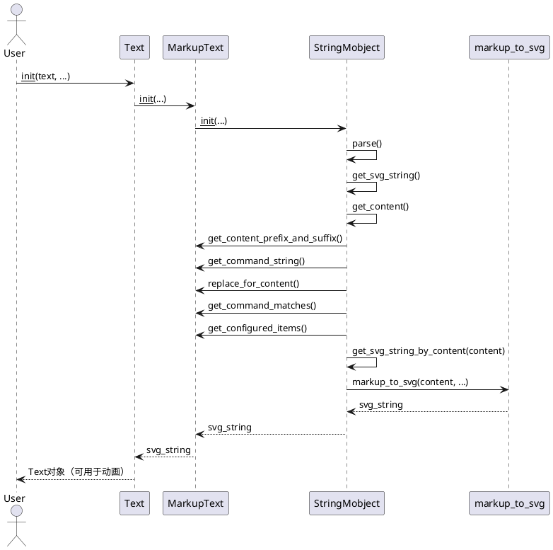

## 1. 类图

## 2. 核心逻辑实现简述
StringMobject

- 作用：抽象基类，负责字符串的分割、标签、选择、子对象（submobject）管理。

- 核心方法：
  - parse()：根据 isolate/protect/命令等分割字符串，生成标签和插入点，支持子字符串的高亮、选择等。
  - find_spans_by_selector()：根据 selector（字符串、正则、区间等）查找 span。
  - select_parts()：根据 selector 返回对应的 VGroup。
  - get_svg_string()：生成 SVG 字符串，支持是否带标签。
  - get_content()：重构字符串，插入标签、属性等。

MarkupText
- 作用：实现 Pango Markup 语法的文本渲染，支持富文本属性（如粗体、斜体、颜色等）。
- 核心方法：
  - get_command_matches()：正则匹配所有 Pango Markup 标签、实体、特殊字符。
  - replace_for_content()：用于内容生成时的替换逻辑（如转义特殊字符）。
  - replace_for_matching()：用于 span 匹配时的替换逻辑（如解码实体）。
  - get_attr_dict_from_command_pair()：解析标签属性，返回属性字典。
  - get_command_string()：生成  或 字符串，插入属性。
  - get_content_prefix_and_suffix()：生成全局属性的前后缀。

Text
- 作用：普通文本，简化命令匹配，仅处理 <>&"' 等特殊字符。
- 核心方法：重载 get_command_matches、replace_for_content 等，简化为普通文本处理。

Code
- 作用：高亮代码，集成 pygments，生成带 Pango Markup 的高亮文本。
- 核心方法：构造时用 pygments 生成 markup，再交给 MarkupText 处理。

## 3. 核心流程

## 4. 总结
- 继承结构：StringMobject（抽象基类）→ MarkupText（富文本）→ Text/Code（具体实现）
- 核心机制：字符串分割、span 匹配、属性插入、SVG 生成、子对象管理
- 渲染流程：构造 → 解析 → 生成内容 → 生成 SVG → 生成 VMobject