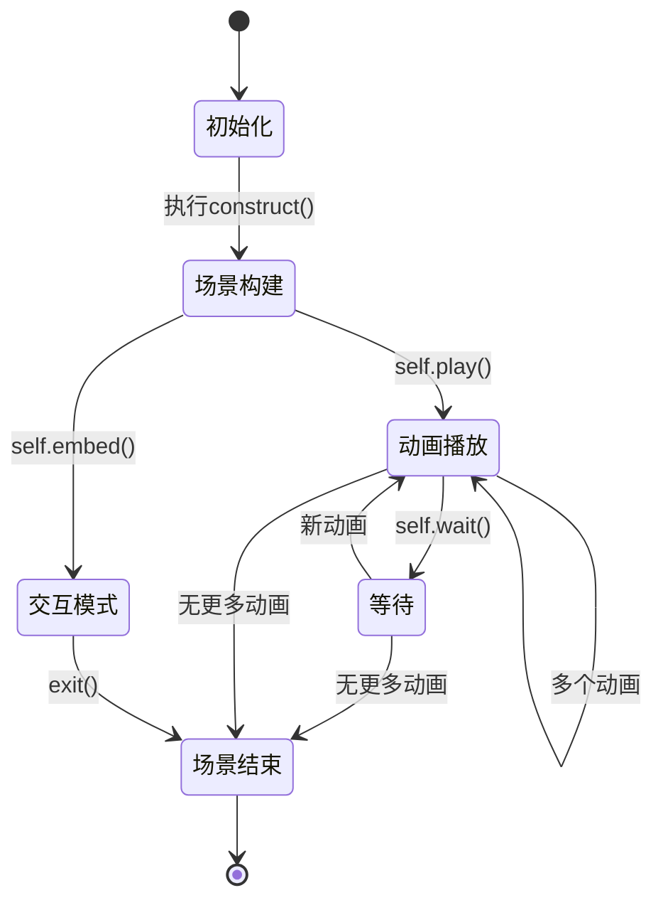
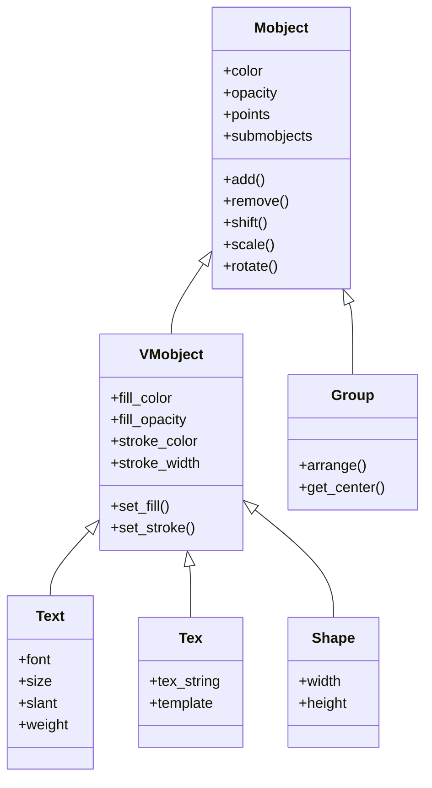
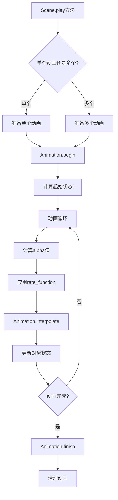
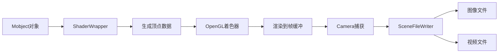
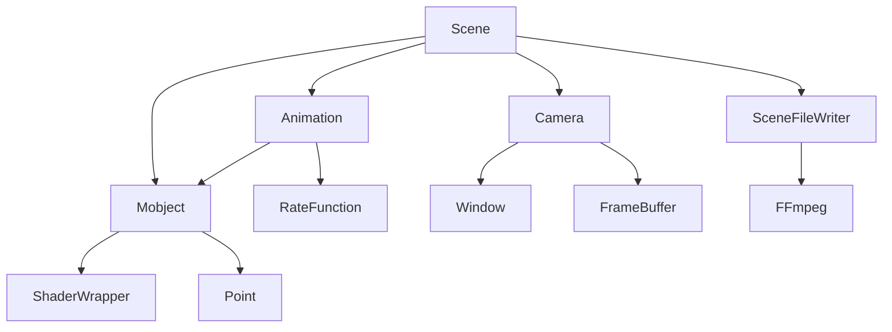
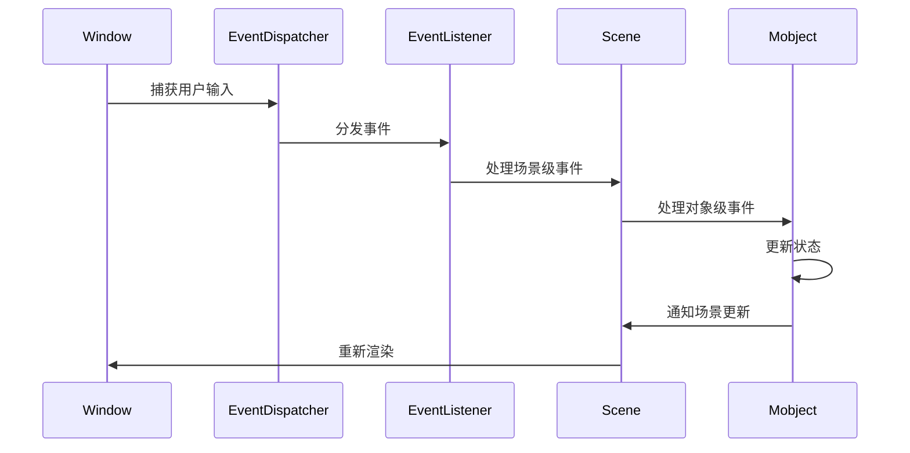

from manimlib.imports import *
## 1. 项目架构图

class CompleteManimDemo(Scene):
    def construct(self):
        # 1. 创建基本图形对象
        dot = Dot(LEFT * 3, color=YELLOW)
        circle = Circle(radius=1, color=BLUE, fill_opacity=0.3).shift(LEFT)
        square = Square(side_length=2, color=GREEN).shift(RIGHT)
        triangle = Polygon(UP, RIGHT + UP, RIGHT, color=ORANGE)
```mermaid
graph TD
    A[Manim项目] --> B[manimlib核心库]
    A --> C[example_scenes.py示例]
    A --> D[docs文档]
    
        # 2. 创建文本和公式
        text = Text("Hello, Manim!", font_size=36, color=PURPLE).to_edge(UP)
        formula = Tex(r"e^{i\pi} + 1 = 0", font_size=48).next_to(text, DOWN)
    B --> E[scene场景模块]
    B --> F[animation动画模块]
    B --> G[mobject对象模块]
    B --> H[camera相机模块]
    B --> I[utils工具模块]
    B --> J[shader_wrapper着色器包装]
    B --> K[config配置模块]
    B --> L[window窗口模块]
    B --> M[event_handler事件处理]
    
        # 3. 创建点云
        points = [np.array([x, np.sin(x), 0]) for x in np.linspace(-3, 3, 30)]
        cloud = DotCloud(points, radius=0.06, color=WHITE, glow_factor=1.5).shift(DOWN * 2)
    G --> G1[基础对象]
    G --> G2[SVG对象]
    G --> G3[几何对象]
    G --> G4[文本对象]
    G --> G5[三维对象]
    
        # 4. 分组与整体变换
        group = VGroup(dot, circle, square, triangle)
        group.arrange(RIGHT, buff=0.8).shift(DOWN)
        group.set_color_by_gradient(RED, YELLOW, GREEN, BLUE)
    F --> F1[基础动画]
    F --> F2[变换动画]
    F --> F3[创建动画]
    F --> F4[淡入淡出]
    F --> F5[指示动画]
    
        # 5. 添加到场景
        self.add(text, formula)
        self.play(FadeIn(group), FadeIn(cloud))
        self.wait(0.5)
    E --> E1[Scene基础场景]
    E --> E2[InteractiveScene交互场景]
    E --> E3[SceneFileWriter文件写入]
```

        # 6. 对象动画与变换
        self.play(
            group.animate.shift(UP * 1.5).scale(0.8),
            cloud.animate.set_color(BLUE).scale(1.2)
        )
        self.wait(0.5)
## 2. 运行架构图

        # 7. 文本和公式变换
        new_text = Text("数学动画引擎", font_size=36, color=BLUE).to_edge(UP)
        new_formula = Tex(r"\int_a^b f(x)dx", font_size=48).next_to(new_text, DOWN)
        self.play(Transform(text, new_text), Transform(formula, new_formula))
        self.wait(0.5)
```mermaid
sequenceDiagram
    participant User as 用户
    participant Main as __main__.py
    participant Config as config.py
    participant Extract as extract_scene.py
    participant Scene as scene.py
    participant Window as window.py
    participant FileWriter as scene_file_writer.py
    
        # 8. 路径动画
        moving_dot = Dot(color=RED).move_to(LEFT * 3)
        path = Arc(radius=3, angle=PI, color=GRAY)
        self.add(path, moving_dot)
        self.play(MoveAlongPath(moving_dot, path), run_time=2)
        self.wait(1)
    User->>Main: 执行命令 (manimgl example_scenes.py Scene名)
    Main->>Config: 解析命令行参数
    Main->>Extract: 提取场景类
    Extract->>Extract: 加载Python模块
    Extract->>Extract: 查找Scene子类
    Extract->>Main: 返回场景实例
    Main->>Window: 创建窗口(如果需要)
    Main->>Scene: 运行场景
    Scene->>Scene: 初始化
    Scene->>Scene: 执行construct()方法
    Scene->>FileWriter: 写入视频/图像
    Scene->>Main: 完成渲染
    Main->>User: 显示结果
```

## 3. 场景生命周期状态机



## 4. 对象层次结构



## 5. 动画系统流程



## 6. 渲染管线



## 7. 核心模块关系图



## 8. 事件处理系统



## 项目核心逻辑解析

Manim是一个数学动画引擎，主要用于创建解释性数学视频。以下是项目的核心实现逻辑：

1. **对象系统**：
    - 所有可视元素都是`Mobject`(数学对象)的子类
    - `VMobject`(矢量对象)提供了基于贝塞尔曲线的形状
    - 对象可以组合、嵌套，形成复杂的层次结构
    - 每个对象有自己的属性(颜色、位置、大小等)和变换方法

2. **动画系统**：
    - `Animation`类是所有动画的基类
    - 动画通过插值函数(`interpolate`)在起始状态和结束状态之间平滑过渡
    - 支持自定义速率函数(`rate_function`)控制动画节奏
    - 可以组合多个动画同时或顺序播放

3. **场景系统**：
    - `Scene`类管理所有对象和动画
    - `construct()`方法定义场景内容和动画序列
    - 支持交互式场景(`InteractiveScene`)进行实时操作
    - 场景负责对象的添加、移除和动画的执行

4. **渲染系统**：
    - 使用OpenGL进行硬件加速渲染
    - `Camera`类负责捕获场景并转换为图像
    - `SceneFileWriter`负责将渲染结果写入视频或图像文件
    - 支持自定义分辨率、帧率和质量设置

5. **配置系统**：
    - 通过YAML文件和命令行参数配置渲染参数
    - 支持全局配置和场景特定配置
    - 可自定义输出路径、质量、预览选项等

6. **事件处理**：
    - 支持键盘和鼠标交互
    - 事件分发系统将用户输入路由到相应的处理程序
    - 允许在交互模式下实时修改场景

## 重点模块实现逻辑

1. **Mobject模块**：
    - 使用NumPy数组存储点数据
    - 提供丰富的变换方法(平移、旋转、缩放等)
    - 支持颜色、透明度等视觉属性
    - 实现了复杂的组合和层次结构

2. **Animation模块**：
    - 基于起始状态和目标状态的插值
    - 支持自定义动画时长和速率函数
    - 提供丰富的预定义动画类型
    - 实现了动画的组合和顺序控制

3. **Scene模块**：
    - 管理对象的添加和移除
    - 控制动画的执行和时间流
    - 处理用户交互和事件
    - 协调相机和文件写入

4. **Camera模块**：
    - 管理视角和投影
    - 捕获场景内容为图像
    - 支持3D场景的渲染
    - 处理帧缓冲和像素数据

5. **渲染模块**：
    - 使用OpenGL着色器进行高效渲染
    - 支持复杂的视觉效果和材质
    - 优化大量对象的渲染性能
    - 处理不同平台的兼容性

通过这些模块的协同工作，Manim能够创建复杂、流畅的数学动画，帮助创作者以视觉方式解释抽象的数学概念。


---

## 9. Manim 完整示例

下面给出一个相对完备的 Manim 场景示例，涵盖了对象创建、变换、分组、动画、文本、公式、点云等典型用法，便于快速理解 Manim 的实际应用。

````python
from manimlib.imports import *

class CompleteManimDemo(Scene):
def construct(self):
# 1. 创建基本图形对象
dot = Dot(LEFT * 3, color=YELLOW)
circle = Circle(radius=1, color=BLUE, fill_opacity=0.3).shift(LEFT)
square = Square(side_length=2, color=GREEN).shift(RIGHT)
triangle = Polygon(UP, RIGHT + UP, RIGHT, color=ORANGE)

        # 2. 创建文本和公式
        text = Text("Hello, Manim!", font_size=36, color=PURPLE).to_edge(UP)
        formula = Tex(r"e^{i\pi} + 1 = 0", font_size=48).next_to(text, DOWN)

        # 3. 创建点云
        points = [np.array([x, np.sin(x), 0]) for x in np.linspace(-3, 3, 30)]
        cloud = DotCloud(points, radius=0.06, color=WHITE, glow_factor=1.5).shift(DOWN * 2)

        # 4. 分组与整体变换
        group = VGroup(dot, circle, square, triangle)
        group.arrange(RIGHT, buff=0.8).shift(DOWN)
        group.set_color_by_gradient(RED, YELLOW, GREEN, BLUE)

        # 5. 添加到场景
        self.add(text, formula)
        self.play(FadeIn(group), FadeIn(cloud))
        self.wait(0.5)

        # 6. 对象动画与变换
        self.play(
            group.animate.shift(UP * 1.5).scale(0.8),
            cloud.animate.set_color(BLUE).scale(1.2)
        )
        self.wait(0.5)

        # 7. 文本和公式变换
        new_text = Text("数学动画引擎", font_size=36, color=BLUE).to_edge(UP)
        new_formula = Tex(r"\int_a^b f(x)dx", font_size=48).next_to(new_text, DOWN)
        self.play(Transform(text, new_text), Transform(formula, new_formula))
        self.wait(0.5)

        # 8. 路径动画
        moving_dot = Dot(color=RED).move_to(LEFT * 3)
        path = Arc(radius=3, angle=PI, color=GRAY)
        self.add(path, moving_dot)
        self.play(MoveAlongPath(moving_dot, path), run_time=2)
        self.wait(1)
````

**说明：**
- 该示例展示了 Manim 的核心能力：对象创建、分组、变换、动画、文本、公式、点云、路径动画等。
- 通过 `VGroup` 可以统一操作多个对象。
- 支持 `Text`、`Tex`、`DotCloud`、`Polygon`、`MoveAlongPath` 等丰富的对象和动画。
- 适合初学者和进阶用户参考和扩展。
